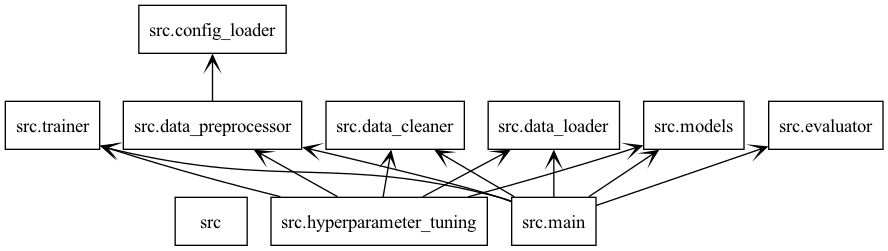
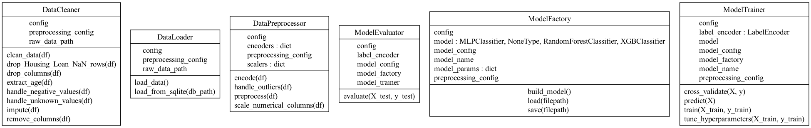
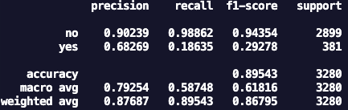
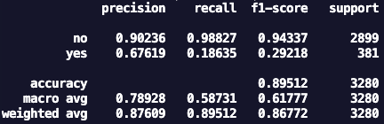
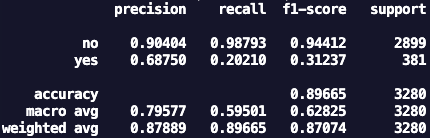
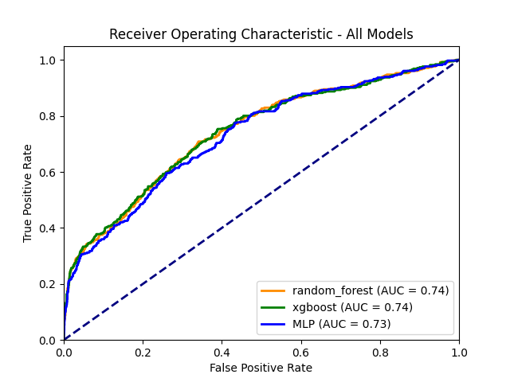

# AIIP Batch 6 Technical Assessment: 🏦✨ AI-Vive-Banking Term Deposit Subscription Prediction ✨🏦

---

## 👤 Author

- **Name:** Er Qi Yang  
- **Email:**  
  - 📧 qysparky@gmail.com  
  - 📧 e0148703@u.nus.edu

---

## 🗂️ Project Structure

```
.
├── src/
│   ├── main.py                # Main pipeline: data processing, training, evaluation
│   ├── data_loader.py         # Loads data from SQLite database
│   ├── data_cleaner.py        # Cleans and imputes missing/invalid data
│   ├── data_preprocessor.py   # Feature engineering, encoding, scaling
│   ├── models.py              # ModelFactory for building/saving/loading models
│   ├── trainer.py             # ModelTrainer for training and tuning
│   ├── evaluator.py           # ModelEvaluator for metrics and reporting
│   ├── hyperparameter_tuning.py # Script for hyperparameter tuning
│   └── config_loader.py       # Loads YAML config files
├── config/
│   ├── config.yaml
│   ├── model_config.yaml
│   └── preprocessing_config.yaml
├── data/
│   ├── bmarket.db             # Raw data (not in the Github repo)
│   └── ... (processed data/reports/hyperparameter outputs)
├── models/
│   └── ... (model outputs)
├── tests/
│   ├── test_data_cleaner.py
│   ├── test_data_loader.py
│   ├── test_data_preprocessor.py
│   ├── test_evaluator.py
│   ├── test_models.py
│   └── test_trainer.py
├── run.sh                     # 🚦 Pipeline execution script
├── requirements.txt           # 📦 Python dependencies
└── README.md                  # 📖 This file!
```
In addition to the structure above, the following PNG files are included in the root directory for README.md visualization:
- `packages_aiip6.png` - Package diagram
- `classes_aiip6.png` - Class diagram
- `report_rf.png` - Random Forest classification report
- `report_xgboost.png` - XGBoost classification report
- `report_mlp.png` - MLP classification report
- `roc_curve_all_models.png` - Combined ROC curves

---

### 📊 Package and Class Diagram

<div align="center">




</div>

---

### 🔗 **How the Packages Communicate**

> 🏁 **Start:**  
> - `data_loader` 📥 loads raw data  
> - ⏩ passes to `data_cleaner` 🧹 for cleaning/imputation  
> - ⏩ then to `data_preprocessor` 🛠️ for feature engineering, encoding, scaling  
> - ⏩ split data is sent to `models` 🏗️ via `ModelFactory`  
> - ⏩ `trainer` 🏋️‍♂️ handles training & hyperparameter tuning  
> - ⏩ `evaluator` 📊 computes metrics & reports  
> - 🔧 Configurations are accessed via `config_loader`  
> - 💾 Results and models are saved for further analysis  
> - 🧪 Tests ensure reliability in the `tests/` directory

---

## 📈 Exploratory Data Analysis (EDA) Summary

- **Data Consistency:**  
  - 🔢 Converted 'Age' from string to numeric, handled outliers (e.g., ages > 140).
- **Handling 'unknown' values:**  
  - ❓ Replaced 'unknown' with NaN for consistent imputation.
- **Imputation:**  
  - 🧮 Used median for skewed numerical features (e.g., Age), mode/random for categorical.
- **Negative Values:**  
  - ➖ Converted negative 'Campaign Calls' to absolute values.
- **Feature Selection:**  
  - ✂️ Dropped columns with excessive missing data (e.g., 'Credit Default', 'Housing Loan').
- **Duplicates:**  
  - 🔍 Checked and removed duplicate rows.
- **Final Transformations Applied:**  
  - 🧹 Outlier handling, missing value imputation, encoding categorical variables, scaling numerical features, and dropping irrelevant columns.

### 📝 EDA Decisions

- 🧩 **Impute or drop NaNs** based on feature importance and missingness.
- 🔄 **Absolute value for 'Campaign Calls'** due to symmetric distribution.
- 🏅 **Median imputation for 'Age'** due to skewness.
- 🏷️ **One-hot encoding for nominal features** and **ordinal encoding for 'Education Level'**.

---

## 🛠️ Feature Processing Table

| **Feature**           | Cleaning Action                | Preprocessing Action         | Rationale/Notes                         |
|------------------------|-------------------------------|-----------------------------|-----------------------------------------|
| **Client ID**         | Dropped                       |                             | Used for tracking, not for modeling. Since all ID are unique in this dataset, this feature does not provide any information for training the models.     |
| **Age**               | Extract, convert to float     | Scale (MinMax)              | Outliers of 150 years old unrealistic, minmax scaling used to help MLP converge faster and ensures that all the numerical data are scaled equally.     |
| **Occupation**        | 'unknown'→NaN, impute         | One-hot encode              | Categorical, missing values imputed     |
| **Marital Status**    | 'unknown'→NaN, impute         | One-hot encode              | Categorical                             |
| **Education Level**   | 'unknown'→NaN, impute         | Ordinal encode              | Natural order: illiterate → basic.4y → basic.6y → basic.9y → high.school → professional.course → university.degree, missing values imputed |
| **Credit Default**    | 'unknown'→NaN, drop if needed | One-hot encode              | Dropped if too many NaNs                |
| **Housing Loan**      | Drop rows with NaN            | One-hot encode              | High missingness of about 60% (refer to EDA.ipynb), dropped rows          |
| **Personal Loan**     | 'unknown'→NaN, impute         | One-hot encode              | Categorical                             |
| **Contact Method**    | 'unknown'→NaN, impute         | One-hot encode              | Categorical                             |
| **Campaign Calls**    | Negative→absolute             | Scale (MinMax)              | Unrealistic negative calls, and the distribution of Subscription Status does not vary significantly between negative and positive Campaign Calls, assume that there was a possible mistake in recording (e.g. accidentally adding a negative sign). Additionally, there is only about 10% of data that have negative Campaign Call values, so it is safe to take this assumption.               |
| **Previous Contact Days** | None                      | None                        | Not scaled because the ROC curve, precision, recall and f1-score is better (albeit marginally) for all 3 models, even though scaling bimodal data is does not affect model performance. These performance parameters are explained in the section below.                    |
| **Subscription Status** | None                        | Label encode (target)        | Target variable                         |

---

## 🤖 Model Choices & Justification

### **1. Random Forest 🌲**
- **Why:** Robust to overfitting and outliers, handles categorical/numerical features, interpretable feature importance. Random Forest is robust to outliers and overfitting because it builds an ensemble of decision trees, each trained on a random subset of the data and features. Outliers are less likely to appear in every tree's training set, so their influence is diluted when aggregating predictions across all trees. Additionally, by averaging the results of many diverse trees, Random Forest reduces the risk of overfitting to noise or anomalies present in the training data, leading to better generalization on unseen data.
- **Features:** Ensemble of decision trees, bagging, handles missing values (to some extent).

### **2. XGBoost 🚀**
- **Why:** XGBoost is a strong choice for this problem because it uses gradient boosting to sequentially build decision trees that correct the errors of previous trees, making it highly accurate even with complex, real-world data. Its built-in regularization and robust loss functions help prevent overfitting and make it resilient to noisy or contaminated data, which is common in marketing datasets. Additionally, XGBoost can automatically handle missing values, ensuring reliable predictions even when the dataset is incomplete. These features make it ideal for predicting client subscription likelihood in a banking context.
- **Features:** Gradient boosting, tree-based, supports parallelization, handles imbalanced data.

### **3. MLP (Multi-Layer Perceptron) 🧠**
- **Why:** MLP is a good choice because it can capture complex, non-linear relationships between client attributes and subscription outcomes, which are common in real-world marketing data. According to the universal approximation theorem, a neural network with at least one hidden layer can approximate any continuous function, making MLPs theoretically capable of modeling intricate patterns in the data. This flexibility allows the model to uncover subtle interactions between features, helping the bank better identify which clients are most likely to respond positively to marketing campaigns. With sufficient data and proper preprocessing, MLPs can generalize well and provide valuable predictive power for this task.
- **Features:** Neural network, requires scaled input, sensitive to NaNs, needs more data.

**Context:**  
As a fresh recruit at AI-Vive-Banking, my mission is to become the crystal ball 🔮 of client subscriptions - predicting who'll say "I do" to our term deposits. 

---

## 📊 Model Evaluation Summary

- **Hyperparameter Tuning:**  
  - All three models tuned using cross-validation (GridSearchCV) with a 5 fold cross validation.
- **Metrics Explained:**  
  - 🟢 **Precision:** Correct positive predictions / All positive predictions.
  - 🟡 **Recall:** Correct positive predictions / All actual positives.
  - 🔵 **F1 Score:** Harmonic mean of precision and recall.
  - 🟣 **Accuracy:** Correct predictions / Total predictions.

### **Evaluation Screenshots**

| Model           | Classification Report Screenshot         |
|-----------------|-----------------------------------------|
| 🌲 Random Forest   |    |
| 🚀 XGBoost         |  |
| 🧠 MLP             |  |


### **ROC Curve for All Models**

<div align="center">



</div>

---

## 🧪 Other Considerations

- **🧪 Tests Directory:**  
  - Contains unit tests for all major components (`data_cleaner`, `data_loader`, `data_preprocessor`, `models`, `trainer`, `evaluator`).
  - Ensures reliability and correctness of data processing and modeling pipeline.
  - Refer to the section below on how to run unit tests.

---

## 🚀 Getting Started

### **1. Clone the Repository**

```sh
git clone https://github.com/theopenguino99/aiip6-Er-Qi-Yang-227J.git
cd aiip6-Er-Qi-Yang-227J
```

### **2. Install Requirements**

```sh
pip install -r requirements.txt
```

### **3. Run the Pipeline**

```sh
bash run.sh
```

- This will execute both the main pipeline and hyperparameter tuning scripts.

### **4. Run Unit Tests**

```sh
cd tests
pytest
# or to show print outputs:
pytest -s
```

### **5. Collaborate**

- 🍴 **Fork the repository** on GitHub.
- 🌿 **Create a new branch** for your feature or bugfix.
- 🔄 **Submit a pull request** with a clear description of your changes.

---

## 🙏 Acknowledgements

- 🙌 Thank you for reading my Technical Assessment Submission!

---